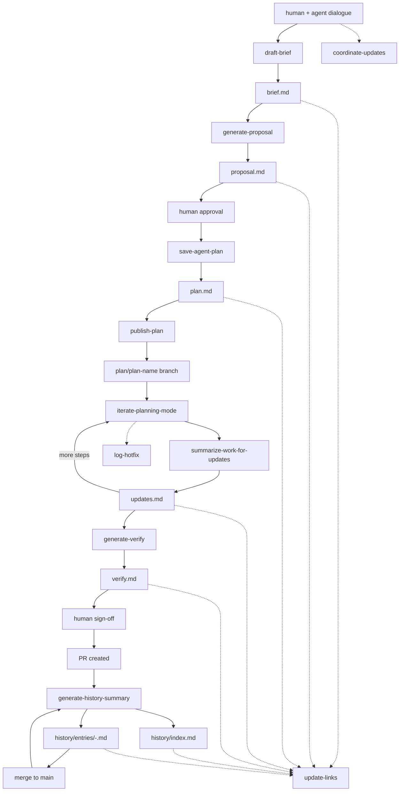

# Bindify

Bindify is a filesystem-based communication protocol for AI agents working on software, where agents communicate by reading and writing structured markdown files inside a `.bindify/` folder at the repo root.

Read this whole file when bindify is in play; load command/template files from `references/` on demand.

## When to invoke each command

Fifteen commands drive bindify. Each one is a self-contained markdown file in `references/commands/`. Read the full command file before executing it.

| User signal | Command | Reference file |
|---|---|---|
| "adapt bindify to this project" / "add a dev server command" / first-time setup in a repo | `configure-project` | `references/commands/configure-project.md` |
| "let's coordinate updates" / "update the coordinator" | `coordinate-updates` | `references/commands/coordinate-updates.md` |
| "capture this planning context as a brief" | `draft-brief` | `references/commands/draft-brief.md` |
| "generate proposal from this brief" | `generate-proposal` | `references/commands/generate-proposal.md` |
| "save this as a plan" / proposal has been approved | `save-agent-plan` | `references/commands/save-agent-plan.md` |
| "/bindify" / "publish this plan branch" | `publish-plan` | `references/commands/publish-plan.md` |
| "run step N" / "execute Step-003" / orchestrator delegating a step | `iterate-planning-mode` | `references/commands/iterate-planning-mode.md` |
| Right after a step finishes, before moving on | `summarize-work-for-updates` | `references/commands/summarize-work-for-updates.md` |
| "scan the architecture" / "build the architecture map" / missing arch object | `scan-architecture` | `references/commands/scan-architecture.md` |
| "log this PR" / ingest a PR into the tracking history | `log-pr` | `references/commands/log-pr.md` |
| "generate the final summary" / "refresh history after PR" / "prepare the UI summary" | `generate-history-summary` | `references/commands/generate-history-summary.md` |
| "open a bindify PR" / publish logs to the `.bindify` submodule | `publish-bindify-pr` | `references/commands/publish-bindify-pr.md` |
| All steps done, ready for human review | `generate-verify` | `references/commands/generate-verify.md` |
| "research the codebase" before proposing | `research-codebase` | `references/commands/research-codebase.md` |
| "repair links/backlinks after edits" | `update-links` | `references/commands/update-links.md` |
| "log an unplanned bugfix" | `log-hotfix` | `references/commands/log-hotfix.md` |

## The pipeline



Alongside this pipeline, `coordinator.md` runs in parallel as a conversation journal, `hotfixes.md` captures unplanned fixes linked back to affected plans, and `.bindify/history/` provides a root-level digest layer for humans and UI surfaces.

## Folder layout

```
.bindify/
├── AGENTS.md                          ← root instructions for any agent entering the repo
├── commands/                          ← canonical command specs
├── templates/                         ← brief, proposal, coordinator, verify, history, hotfixes, architecture, project templates
├── docs/                              ← cross-feature reference docs (event schemas, etc.)
├── project/                           ← host-project adaptation (committed here; never in the skill repo)
│   ├── profile.md                     ← stack, category, conventions, constraints
│   ├── environment.md                 ← how to start/run/verify this repo
│   ├── local.md                       ← machine-local overrides (gitignored)
│   └── commands/                      ← optional project-specific command overrides/additions
│       └── start-dev.md               ← e.g. start localhost for a web project
├── history/
│   ├── index.md                       ← compact root history overview for humans/UI
│   └── entries/
│       └── <date>-<slug>.md           ← synthesized summary with links to plans, features, PRs, docs
├── architecture/                      ← the architecture object graph (Capacities-style)
│   ├── _map.md                        ← high-level skeleton + object index
│   ├── system/<name>.md               ← type: system
│   ├── modules/<name>.md              ← type: module | service | integration
│   ├── data/<name>.md                 ← type: data-model
│   └── standards/<name>.md            ← type: standard | pattern
└── development/
    ├── features/
    │   └── <feature-name>/
    │       ├── coordinator.md          ← human dialogue log, intent, pivots
    │       └── plans/
    │           └── <plan-name>/
    │               ├── brief.md
    │               ├── proposal.md
    │               ├── plan.md
    │               ├── updates.md      ← append-only execution log
    │               └── verify.md
    ├── fixes/
    │   └── <feature-name>/
    │       └── hotfixes.md            ← unplanned bugfix log
    ├── refactor/
    └── chore/
```

## Two responsibilities

**Coordinator** — `<feature>/coordinator.md`. Human-facing journal that captures intent, decisions, pivots, and status via `coordinate-updates`.

**Executor** — the pipeline inside `plans/<plan-name>/`. Agent-driven. Each phase has one source document and a clear owner:

| Phase | Document | Who drives |
|---|---|---|
| plan | `brief.md` | human + AI |
| propose | `proposal.md` | AI |
| review | `proposal.md` (annotated) | human |
| apply | `plan.md` + `updates.md` | AI via `iterate-planning-mode` |
| verify | `verify.md` | human checklist |
| summarize-for-history | `.bindify/history/index.md` + `.bindify/history/entries/<date>-<slug>.md` | AI via `generate-history-summary` |

## Architecture object graph

Bindify models the system itself as a web of typed **objects** under `.bindify/architecture/` — one markdown
file per object, linked by `[[wiki-links]]`, browsable like Capacities. Markdown is the source of truth.

Object types: `system`, `module`, `service`, `data-model`, `integration`, `pattern`, `standard`. Edges are
derived from the **Depends on** (`depends-on`), **Used by** (`used-by`), and **Standards & patterns** (`follows`)
sections of each object file.

`scan-architecture` builds a small, reliable skeleton first (`bootstrap`), then fills it in incrementally
(`fill`) as changes land. **Responsibility is stable; fill only appends change-log lines and adds edges.**

## Logs connect changes to architecture

A log is not a changelog. Every `updates.md` entry must carry an **Impact & Connections** section (abstract
ripple effects — what else the change can affect) and an **Architecture** section (`[[wiki-links]]` to the
objects it `created` / `modified` / `touches`). This is what turns the log into a connected graph instead of a
flat history.

`updates.md` is still the execution ledger, not the best user-facing overview. Bindify now treats root history
summaries as a separate layer: concise synthesized narratives that read the step logs, link back to them, and
explain the combined effect on features, architecture, and adjacent docs/research.

## PR-driven logging flow

Each PR is a unit of change. The vision flow:

1. Human + agent plan a feature at a high level → `coordinator.md` + `brief.md` + `proposal.md`.
2. Agent implements step 1 in planning mode → `plan.md` + `iterate-planning-mode`.
3. Each implementation step appends a bounded, architecture-aware entry to `updates.md`.
4. `generate-verify` builds the human review checklist from those step entries.
5. Once the product PR exists, `generate-history-summary` creates or refreshes a root history entry and updates
   `history/index.md` so the change is understandable without reading the raw step log.
6. `log-pr` reads the PR (gh CLI → iterate steps file → git diff fallback), appends the impact-aware PR log,
   records alignment against `standard`/`pattern` objects, and runs `scan-architecture fill`.
7. After merge, `generate-history-summary` runs again in `merged` mode so the root history reflects final
   outcome and status.
8. `publish-bindify-pr` opens a PR to the `.bindify` submodule with the new logs + architecture updates.

## Hard rules

- **Never modify `plan.md` during apply.** Execution state goes into `updates.md` only.
- **Every update entry needs Impact & Connections + Architecture sections.** No flat changelogs.
- **Architecture `Responsibility` is human-owned.** `scan-architecture fill` appends change-log lines and edges only — it never rewrites a responsibility.
- **`updates.md` is append-only.** Initialize with a feature overview on first creation; never rewrite past entries.
- **Root history is the digest layer.** `history/index.md` and `history/entries/*.md` may be refreshed to keep the best current synthesis.
- **`hotfixes.md` is append-only.** Log unplanned fixes; do not rewrite history.
- **Never introduce scope beyond the current step.** Note observations, don't act on them.
- **Repo-relative paths only.** Never absolute paths.
- **No code in context files.** File paths and symbol names only.
- **When in doubt, stop and ask.** Especially when required inputs are missing.

## Architecture: orchestrator + executors

Bindify is the glue between an orchestrator agent (Claude Code, Cursor) and executor agents (pi instances, often in Docker containers). The shared workspace — mounted into every container — is the entire communication channel.

Executors only need to know one thing per invocation: which `STEP_ID` in which `plan.md`. They read the step, do the work, append to `updates.md`, exit.

For the orchestrator vs executor model, see `references/docs/workflow.md`.

## Git tracking workflow

Bindify tracking runs in a dedicated bindify repository tied to one product, even when product code spans multiple repos.

- `main` is stable history.
- Every approved plan is published to `plan/<plan-name>` via `publish-plan`.
- Executor updates and hotfix logs are committed to the active plan branch.
- Root history summaries are generated when a PR is created and refreshed after merge to `main`.
- Human sign-off on `verify.md` gates merge back to `main`.

See `references/docs/workflow.md` for the repo and branch diagram.

## Markdown linking conventions

Bindify markdown files should be navigable as an Obsidian graph.

- Use inline `[[wiki-links]]` when referencing related docs.
- Maintain a `## Related` section at the bottom of each file.
- Run `update-links` after commands that write markdown files.

See `references/docs/workflow.md` for the markdown link graph diagram.

## Skill location: global vs project

Two natural placements, often used together:

- **Global** — `~/.bindify/` cloned on your machine, with `commands/`, `templates/`, and this skill. Shared across all projects.
- **Project-local** — `.bindify/` inside each repo, with `development/` and project history. Committed alongside the code.

Pi discovers skills by walking up the directory tree, so the global one is found from any project. The project-local `.bindify/` overrides or extends it.

## Project adaptation layer

Host projects adapt Bindify via `.bindify/project/`, written by `configure-project`. That folder is path-disjoint from the synced skill surface (`SKILL.md`, `commands/`, `templates/`, `docs/`), so pulling skill updates never conflicts with project-local files.

- **Committed by default** in the host repo (`profile.md`, `environment.md`, `commands/`) so teammates and CI agents share how to run the project.
- **Machine-local only:** `project/local.md` / `project/local.*` are gitignored; never put secrets in committed project docs — reference env file paths instead.
- **Resolution order:** `project/commands/<name>.md` overrides a canonical command of the same name; `project/environment.md` is the source of truth for start/test/lint/build — agents must not guess.
- The Bindify skill/source repo never ships a `project/` folder; adaptation lives only in host projects.

## What to read next

- `references/AGENTS.md` — concise entry-point rules for agents
- `references/docs/workflow.md` — visual deep-dive (repo branches, link graph, orchestrator model)
- `references/commands/<name>.md` — load on demand when invoking a command
- `references/templates/<name>.md` — load when creating a new brief, proposal, coordinator, verify, history, hotfix, architecture, or project file

When invoking a command, **read the full command file first**. The summaries in this skill are signposts, not substitutes.
