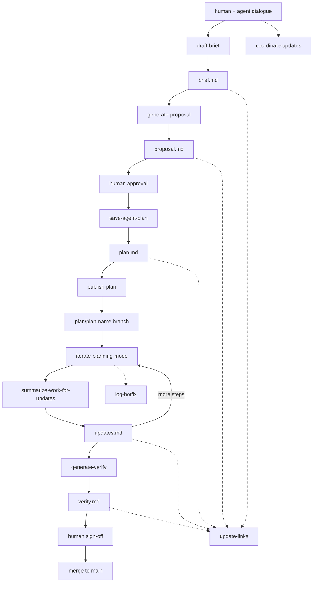

# Bindify

Bindify is a filesystem-based communication protocol for AI agents working on software, where agents communicate by reading and writing structured markdown files inside a `.bindify/` folder at the repo root.

Read this whole file when bindify is in play; load command/template files from `references/` on demand.

## When to invoke each command

Eleven commands drive bindify. Each one is a self-contained markdown file in `references/commands/`. Read the full command file before executing it.

| User signal | Command | Reference file |
|---|---|---|
| "let's coordinate updates" / "update the coordinator" | `coordinate-updates` | `references/commands/coordinate-updates.md` |
| "capture this planning context as a brief" | `draft-brief` | `references/commands/draft-brief.md` |
| "generate proposal from this brief" | `generate-proposal` | `references/commands/generate-proposal.md` |
| "save this as a plan" / proposal has been approved | `save-agent-plan` | `references/commands/save-agent-plan.md` |
| "/bindify" / "publish this plan branch" | `publish-plan` | `references/commands/publish-plan.md` |
| "run step N" / "execute Step-003" / orchestrator delegating a step | `iterate-planning-mode` | `references/commands/iterate-planning-mode.md` |
| Right after a step finishes, before moving on | `summarize-work-for-updates` | `references/commands/summarize-work-for-updates.md` |
| All steps done, ready for human review | `generate-verify` | `references/commands/generate-verify.md` |
| "research the codebase" before proposing | `research-codebase` | `references/commands/research-codebase.md` |
| "repair links/backlinks after edits" | `update-links` | `references/commands/update-links.md` |
| "log an unplanned bugfix" | `log-hotfix` | `references/commands/log-hotfix.md` |

## The pipeline



Alongside this pipeline, `coordinator.md` runs in parallel as a conversation journal and `hotfixes.md` captures unplanned fixes linked back to affected plans.

## Folder layout

```
.bindify/
├── AGENTS.md                          ← root instructions for any agent entering the repo
├── commands/                          ← canonical command specs
├── templates/                         ← brief, proposal, coordinator, verify, hotfixes templates
├── docs/                              ← cross-feature reference docs (event schemas, etc.)
└── development/
    ├── features/
    │   └── <feature-name>/
    │       ├── coordinator.md          ← human dialogue log, intent, pivots
    │       └── plans/
    │           └── <plan-name>/
    │               ├── brief.md
    │               ├── proposal.md
    │               ├── plan.md
    │               ├── updates.md      ← append-only execution log
    │               └── verify.md
    ├── fixes/
    │   └── <feature-name>/
    │       └── hotfixes.md            ← unplanned bugfix log
    ├── refactor/
    └── chore/
```

## Two responsibilities

**Coordinator** — `<feature>/coordinator.md`. Human-facing journal that captures intent, decisions, pivots, and status via `coordinate-updates`.

**Executor** — the pipeline inside `plans/<plan-name>/`. Agent-driven. Each phase has one source document and a clear owner:

| Phase | Document | Who drives |
|---|---|---|
| plan | `brief.md` | human + AI |
| propose | `proposal.md` | AI |
| review | `proposal.md` (annotated) | human |
| apply | `plan.md` + `updates.md` | AI via `iterate-planning-mode` |
| verify | `verify.md` | human checklist |

## Hard rules

- **Never modify `plan.md` during apply.** Execution state goes into `updates.md` only.
- **`updates.md` is append-only.** Initialize with a feature overview on first creation; never rewrite past entries.
- **`hotfixes.md` is append-only.** Log unplanned fixes; do not rewrite history.
- **Never introduce scope beyond the current step.** Note observations, don't act on them.
- **Repo-relative paths only.** Never absolute paths.
- **No code in context files.** File paths and symbol names only.
- **When in doubt, stop and ask.** Especially when required inputs are missing.

## Architecture: orchestrator + executors

Bindify is the glue between an orchestrator agent (Claude Code, Cursor) and executor agents (pi instances, often in Docker containers). The shared workspace — mounted into every container — is the entire communication channel.

Executors only need to know one thing per invocation: which `STEP_ID` in which `plan.md`. They read the step, do the work, append to `updates.md`, exit.

For the orchestrator vs executor model, see `references/docs/workflow.md`.

## Git tracking workflow

Bindify tracking runs in a dedicated bindify repository tied to one product, even when product code spans multiple repos.

- `main` is stable history.
- Every approved plan is published to `plan/<plan-name>` via `publish-plan`.
- Executor updates and hotfix logs are committed to the active plan branch.
- Human sign-off on `verify.md` gates merge back to `main`.

See `references/docs/workflow.md` for the repo and branch diagram.

## Markdown linking conventions

Bindify markdown files should be navigable as an Obsidian graph.

- Use inline `[[wiki-links]]` when referencing related docs.
- Maintain a `## Related` section at the bottom of each file.
- Run `update-links` after commands that write markdown files.

See `references/docs/workflow.md` for the markdown link graph diagram.

## Skill location: global vs project

Two natural placements, often used together:

- **Global** — `~/.bindify/` cloned on your machine, with `commands/`, `templates/`, and this skill. Shared across all projects.
- **Project-local** — `.bindify/` inside each repo, with `development/` and project history. Committed alongside the code.

Pi discovers skills by walking up the directory tree, so the global one is found from any project. The project-local `.bindify/` overrides or extends it.

## What to read next

- `references/AGENTS.md` — concise entry-point rules for agents
- `references/docs/workflow.md` — visual deep-dive (repo branches, link graph, orchestrator model)
- `references/commands/<name>.md` — load on demand when invoking a command
- `references/templates/<name>.md` — load when creating a new brief, proposal, coordinator, verify, or hotfix file

When invoking a command, **read the full command file first**. The summaries in this skill are signposts, not substitutes.
