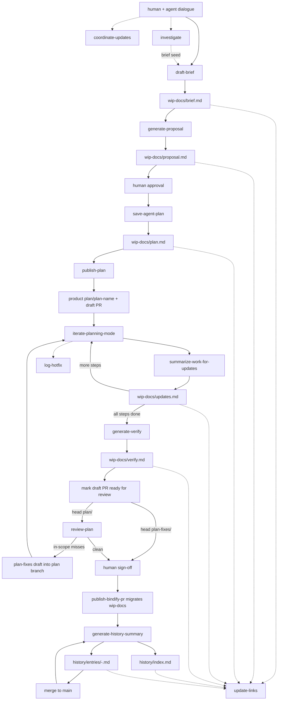

# Bindify

Bindify is a filesystem-based communication protocol for AI agents working on software. **Active feature work lives in a flat `wip-docs/` folder at the project root** so agents can reliably read and write planning artifacts. The Bindify tracking repo (`.bindify/` or `bindify/` — often a submodule) holds durable history, architecture, and completed plans after migration.

Read this whole file when bindify is in play; load command/template files from this skill's `references/` on demand.

## Three path layers (do not confuse)

| Layer | Where | What lives there | Agent rule |
|---|---|---|---|
| **Skill** | Installed skill (e.g. `~/.agents/skills/bindify/`) | `SKILL.md`, `references/commands/`, `references/templates/` | **How to run bindify.** Always read commands and templates from here. Never look inside the project tracking folder for command specs or templates. |
| **Active WIP** | `<project-root>/wip-docs/` | `brief.md`, `proposal.md`, `plan.md`, `updates.md`, `verify.md`, `coordinator.md` | **Write active feature docs here.** Flat; one feature at a time. |
| **Tracking repo** | `<project-root>/.bindify/` **or** `<project-root>/bindify/` (folder or submodule) | `development/`, `architecture/`, `history/`, `project/` | **Durable project memory only.** Read `project/` and `architecture/` for context. Write migrated plans/history here at packaging time — not during draft/apply. |

Example: `draft-brief` → read template from **skill** `references/templates/brief.md` → optionally read **tracking** `project/profile.md` / `architecture/_map.md` for context → write **`wip-docs/brief.md`**. Do **not** open `.bindify/commands/` or `.bindify/templates/` expecting skill implementation.

Resolve tracking root as: explicit path → `.bindify/` if present → `bindify/` if present → ask if neither.

## When to invoke each command

These commands drive bindify. Each one is a self-contained markdown file in `references/commands/`. Read the full command file before executing it. Prototype mode and macOS worktree verification are commands of this skill, not separate skills.

| User signal | Command | Reference file |
|---|---|---|
| "adapt bindify to this project" / "add a dev server command" / first-time setup in a repo | `configure-project` | `references/commands/configure-project.md` |
| "let's coordinate updates" / "update the coordinator" | `coordinate-updates` | `references/commands/coordinate-updates.md` |
| "capture this planning context as a brief" | `draft-brief` | `references/commands/draft-brief.md` |
| "generate proposal from this brief" | `generate-proposal` | `references/commands/generate-proposal.md` |
| "save this as a plan" / proposal has been approved | `save-agent-plan` | `references/commands/save-agent-plan.md` |
| "/bindify" / "publish this plan" / kick off product plan branch | `publish-plan` | `references/commands/publish-plan.md` |
| "run step N" / "execute Step-003" / "/iterate-planning-mode" / orchestrator delegating a step | `iterate-planning-mode` | `references/commands/iterate-planning-mode.md` |
| "review the open plan PR" / ready-for-review on `plan/*` | `review-plan` | `references/commands/review-plan.md` |
| "prototype this" / "/prototype-mode" / Step-001 UI mock before real wiring | `prototype-mode` | `references/commands/prototype-mode.md` |
| "verify this branch" / "/verify-worktree" / open or test an agent branch on macOS | `verify-worktree` | `references/commands/verify-worktree.md` |
| Right after a step finishes, before moving on | `summarize-work-for-updates` | `references/commands/summarize-work-for-updates.md` |
| "scan the architecture" / "build the architecture map" / missing arch object | `scan-architecture` | `references/commands/scan-architecture.md` |
| "log this PR" / ingest a PR into the tracking history | `log-pr` | `references/commands/log-pr.md` |
| "generate the final summary" / "refresh history after PR" / "prepare the UI summary" | `generate-history-summary` | `references/commands/generate-history-summary.md` |
| "open a bindify PR" / publish logs to the `.bindify` submodule | `publish-bindify-pr` | `references/commands/publish-bindify-pr.md` |
| All steps done, ready for human review | `generate-verify` | `references/commands/generate-verify.md` |
| "investigate this" / "what did we already fix" / research a feature or fix before a brief | `investigate` | `references/commands/investigate.md` |
| "research the codebase" before proposing | `research-codebase` | `references/commands/research-codebase.md` |
| "repair links/backlinks after edits" | `update-links` | `references/commands/update-links.md` |
| "log an unplanned bugfix" | `log-hotfix` | `references/commands/log-hotfix.md` |

## The pipeline



Alongside this pipeline, `wip-docs/coordinator.md` runs in parallel as a conversation journal. Unplanned fixes may still land under the Bindify repo's `development/fixes/`. After migration, `.bindify/history/` (or `bindify/history/`) provides a root-level digest layer for humans and UI surfaces.

`investigate` stays off this pipeline. It lists tracking feature-folder names, reads related fixes, and only then looks at product code. Its **Brief seed** is `DISCUSSION_SOURCES` for `draft-brief`. It does not write the brief.

## Active work: `wip-docs/`

Why a flat root folder? The Bindify tracking repo is often a **nested git repo / submodule** (`.bindify/` or `bindify/`). Many agents cannot reliably read or write inside submodule boundaries or hidden dot-directories during feature work. `wip-docs/` stays in the **host project root** so every agent can see the active plan.

```
<project-root>/
├── wip-docs/                          ← ACTIVE feature only (flat; host repo)
│   ├── coordinator.md                 ← human dialogue log for this feature
│   ├── brief.md
│   ├── proposal.md
│   ├── plan.md
│   ├── updates.md                     ← append-only execution log
│   └── verify.md
├── .bindify/   or   bindify/          ← durable tracking repo (often a submodule)
│   ├── ...
│   └── development/...                ← destination after migration
└── ... product source ...
```

Rules for `wip-docs/`:

- **One active feature at a time.** Flat layout — no nested category/feature/plan folders while WIP.
- Every artifact must carry **Category**, **Feature**, and **Plan** metadata in its header so migration knows the destination path.
- Agents plan and execute **only** against `wip-docs/*` until packaging.
- On `publish-bindify-pr` / `log-pr`, docs migrate into the Bindify repo under `development/<category>/<feature-name>/plans/<plan-name>/`, the coordinator merges into the feature folder, then `wip-docs/` is removed from the host root.

## Folder layout (Bindify tracking repo)

Durable project memory only. Path may be `.bindify/` or `bindify/`. This is **not** the skill install — do not expect `commands/` or skill `templates/` here.

```
.bindify/   (or bindify/)
├── project/                           ← host-project adaptation
│   ├── profile.md                     ← stack, category, conventions, constraints
│   ├── environment.md                 ← how to start/run/verify this repo
│   ├── local.md                       ← machine-local overrides (gitignored)
│   └── commands/                      ← optional *project* command overrides (not skill commands)
│       └── start-dev.md
├── history/
│   ├── index.md
│   └── entries/
│       └── <date>-<slug>.md
├── architecture/
│   ├── _map.md
│   ├── system/<name>.md
│   ├── modules/<name>.md
│   ├── data/<name>.md
│   └── standards/<name>.md
└── development/
    ├── features/
    │   └── <feature-name>/
    │       ├── coordinator.md          ← merged from wip-docs on promote
    │       └── plans/
    │           └── <plan-name>/
    │               ├── brief.md
    │               ├── proposal.md
    │               ├── plan.md
    │               ├── updates.md
    │               └── verify.md
    ├── fixes/
    │   └── <feature-name>/
    │       └── hotfixes.md
    ├── refactor/
    └── chore/
```

Canonical command specs and templates always come from the **skill** (`references/commands/`, `references/templates/`), not from this tracking tree.

## Two responsibilities

**Coordinator** — `wip-docs/coordinator.md` while active; after migration, `<feature>/coordinator.md` in the Bindify repo. Human-facing journal via `coordinate-updates`.

**Executor** — the pipeline inside `wip-docs/` (then the migrated plan folder). Agent-driven. Each phase has one source document and a clear owner:

| Phase | Document | Who drives |
|---|---|---|
| plan | `wip-docs/brief.md` | human + AI |
| propose | `wip-docs/proposal.md` | AI |
| review | `wip-docs/proposal.md` (annotated) | human |
| apply | `wip-docs/plan.md` + `wip-docs/updates.md` | AI via `iterate-planning-mode` |
| verify | `wip-docs/verify.md` | human checklist |
| review | open `plan/` PR | AI via `review-plan` (append-only fix steps on `plan-fixes/`) |
| migrate | copy into Bindify `development/...` + remove `wip-docs/` | AI via `publish-bindify-pr` / `log-pr` |
| summarize-for-history | `.bindify/history/index.md` + `.bindify/history/entries/<date>-<slug>.md` | AI via `generate-history-summary` |

## Architecture object graph

Bindify models the system itself as a web of typed **objects** under `.bindify/architecture/` — one markdown
file per object, linked by `[[wiki-links]]`, browsable like Capacities. Markdown is the source of truth.

Object types: `system`, `module`, `service`, `data-model`, `integration`, `pattern`, `standard`. Edges are
derived from the **Depends on** (`depends-on`), **Used by** (`used-by`), and **Standards & patterns** (`follows`)
sections of each object file.

`scan-architecture` builds a small, reliable skeleton first (`bootstrap`), then fills it in incrementally
(`fill`) as changes land. **Responsibility is stable; fill only appends change-log lines and adds edges.**

## Logs connect changes to architecture

A log is not a changelog. Every `updates.md` entry must carry an **Impact & Connections** section (abstract
ripple effects — what else the change can affect) and an **Architecture** section (`[[wiki-links]]` to the
objects it `created` / `modified` / `touches`). This is what turns the log into a connected graph instead of a
flat history.

`updates.md` is still the execution ledger, not the best user-facing overview. Bindify now treats root history
summaries as a separate layer: concise synthesized narratives that read the step logs, link back to them, and
explain the combined effect on features, architecture, and adjacent docs/research.

## PR-driven logging flow

Each PR is a unit of change. The vision flow:

1. Human + agent plan a feature at a high level → write into `wip-docs/` (`coordinator.md` + `brief.md` + `proposal.md`).
2. After approval, `save-agent-plan` writes `wip-docs/plan.md`; `publish-plan` ensures product branch `plan/<plan-name>` (reusing it if it already exists; forking from the current parent like `release/*` or `feature/*` only when needed) has committed `wip-docs/`, is pushed, and opens a **draft** PR — no Bindify submodule writes, no `feature/` branch inventing.
3. The **planner** agent that ran `publish-plan` **stops and waits** for the draft to become ready for review. A **separate executor** agent (draft-created trigger) runs `iterate-planning-mode` against `wip-docs/plan.md`; each step appends to `wip-docs/updates.md`.
4. When every step has an updates entry, the executor finish path runs `generate-verify` and marks the draft PR **ready for review** (`gh pr ready`). The executor stops. It does not keep committing on `plan/<leaf>`.
5. A **reviewer** agent runs `review-plan` on that ready PR when the head is `plan/*`. It compares the diff to the brief, the plan, and `updates.md`. Improvements are a PR comment only. In-scope misses (unmet done criteria, unmet brief success criteria, missing or wrong planned behavior) are appended as new steps — existing steps stay unchanged — on branch `plan-fixes/<leaf>` (same leaf as `plan/<leaf>`). That branch gets one **draft** PR whose base is the plan branch, not `main` or `release/*`. This round happens once.
6. Draft-created on `plan-fixes/*` starts the executor again, only for the new steps. The finish path marks **that** draft ready. `ready_for_review` on `plan-fixes/*` does not start another reviewer. A human merges the fixes PR into the plan branch, or reviews the plan PR directly when `review-plan` found nothing to schedule.
7. Once the product PR is ready/merged as appropriate, `log-pr` / `publish-bindify-pr` **migrates** `wip-docs/` into the Bindify tracking repo under `development/<category>/<feature>/plans/<plan>/`, merges `coordinator.md`, and deletes `wip-docs/`.
8. `generate-history-summary` creates or refreshes a root history entry and updates `history/index.md`.
9. `log-pr` records alignment against `standard`/`pattern` objects and runs `scan-architecture fill`.
10. After merge, `generate-history-summary` runs again in `merged` mode so the root history reflects final outcome and status.
11. `publish-bindify-pr` opens a PR to the Bindify submodule with the migrated logs + architecture updates.

## Hard rules

- **Active docs live in `wip-docs/` until migration.** Do not write active brief/proposal/plan/updates/verify/coordinator into the Bindify submodule during apply.
- **Implementation branches are `plan/<leaf>` and, after review, one `plan-fixes/<leaf>`.** `publish-plan` creates the plan branch. Only `review-plan` may create `plan-fixes/<leaf>`, and its draft PR targets the plan branch. Never create `feature/...`. Executors never create a branch; they stay on the draft head that triggered them. `FEATURE_NAME` in docs is metadata, not a branch name.
- **Never modify existing plan steps during apply.** Execution state goes into `updates.md` only. After the plan PR is open, `review-plan` may append new steps on `plan-fixes/` only.
- **Every update entry needs Impact & Connections + Architecture sections.** No flat changelogs.
- **Architecture `Responsibility` is human-owned.** `scan-architecture fill` appends change-log lines and edges only — it never rewrites a responsibility.
- **`updates.md` is append-only.** Initialize with a feature overview on first creation; never rewrite past entries.
- **Root history is the digest layer.** `history/index.md` and `history/entries/*.md` may be refreshed to keep the best current synthesis.
- **`hotfixes.md` is append-only.** Log unplanned fixes; do not rewrite history.
- **Never introduce scope beyond the current step.** Note observations, don't act on them.
- **Word limits for planning:** `brief.md` must be ≤ 150 words. `proposal.md` must be ≤ 250 words.
- **Prototype-first:** For user-facing features, `Step-001` must be a mock UI / Workflow prototype to validate flow before real data/backend integration.
- **Repo-relative paths only.** Never absolute paths.
- **No code in context files.** File paths and symbol names only.
- **Investigate before the codebase.** For a feature or fix question, `investigate` scans tracking feature-folder names and reads related fixes before any product-code research. It does not write the brief.
- **Clarify before capture.** Before `brief.md`, and before writing any user decision the user has not stated, ask about intention, necessity, and missing inputs, then wait. See `references/docs/working-style.md`.
- **Chat is caveman.** User-facing replies follow [caveman](https://github.com/JuliusBrussee/caveman) full. Artifacts, commits, and PR text stay normal prose. Questions, security warnings, and irreversible confirmations stay unambiguous.
- **Plan and build with ponytail.** Proposals, plans, and implementation follow the [ponytail](https://github.com/DietrichGebert/ponytail) ladder. Planning asks before dropping a user request. An approved step is the scope; climb the ladder inside it.

## Architecture: orchestrator + executors

Bindify is the glue between an orchestrator agent (Claude Code, Cursor) and executor agents (pi instances, often in Docker containers). The shared workspace — mounted into every container — is the entire communication channel.

Executors only need to know one thing per invocation: which `STEP_ID` in which `plan.md`. They read the step, do the work, append to `updates.md`, exit.

The reviewer is a third role. After a `plan/*` PR is ready, `review-plan` either comments that the plan is clean or appends in-scope fix steps and opens one `plan-fixes/<leaf>` draft. It does not implement. `ready_for_review` on `plan-fixes/*` goes to a human.

For the orchestrator vs executor model, see `references/docs/workflow.md`.

## Git tracking workflow

Two git surfaces, different jobs:

**Product repo**
- `publish-plan` ensures product branch `plan/<plan-name>` has committed `wip-docs/`, is pushed, and opens a **draft** PR into the parent (`main`, `release/*`, `feature/*`, …) so draft-created triggers can start **executor** agents.
- The **planner** that ran `publish-plan` does not implement. It waits until the draft is marked ready for review, then waits again while `review-plan` runs. If that opens a fixes draft, it waits until a human merges `plan-fixes/<leaf>` into `plan/<leaf>`.
- Parent/`BASE` is the current branch when it is `main`, `release/*`, `feature/*`, etc. Original implementation stays on `plan/<leaf>`. The one review round uses `plan-fixes/<leaf>` stacked onto that branch.
- If `plan/<plan-name>` already exists, reuse it — never create `feature/...` from this command, and never fork a new branch while already on the matching `plan/` branch.
- Executors commit **one commit per plan step** on the draft-PR head that triggered them (`plan/<leaf>` or, for the review round, `plan-fixes/<leaf>`) via `iterate-planning-mode`, authored as `blanche <blanche@bindify.app>` (per-commit `--author`, never global git config). Never create a new branch during iterate.
- When the last unfinished step is done, `iterate-planning-mode` runs `generate-verify` (separate commit), pushes the same branch, then marks **that** draft PR **ready for review** (`gh pr ready`). After that, `plan/<leaf>` stays frozen so a fixes append can merge.
- `ready_for_review` on `plan/*` starts `review-plan`. That command either comments that the plan is clean, or appends in-scope fix steps and opens one draft from `plan-fixes/<leaf>` into `plan/<leaf>`. `ready_for_review` on `plan-fixes/*` does not start another reviewer.
- Human sign-off on `wip-docs/verify.md` / the ready plan PR gates merge. When a fixes draft exists, merge it into the plan branch before that sign-off.

**Bindify tracking repo** (`.bindify/` or `bindify/`, often a submodule)
- Untouched during apply.
- `publish-bindify-pr` / `log-pr` migrate completed WIP into `development/...`, write history/architecture, open a Bindify `log/pr-*` PR, and bump the submodule pointer.
- Tracking `main` is stable durable history after those log PRs merge.

See `references/docs/workflow.md` for the repo and branch diagram.

## Markdown linking conventions

Bindify markdown files should be navigable as an Obsidian graph.

- Use inline `[[wiki-links]]` when referencing related docs.
- Maintain a `## Related` section at the bottom of each file.
- Run `update-links` after commands that write markdown files.

See `references/docs/workflow.md` for the markdown link graph diagram.

## Skill location: global vs project

Three distinct places — never treat the tracking submodule as the skill:

- **Skill install** — e.g. `~/.agents/skills/bindify/` with `SKILL.md` + `references/`. Source of all canonical commands and templates.
- **Project tracking** — `.bindify/` or `bindify/` inside the product repo (often a submodule) for `development/`, `architecture/`, `history/`, `project/`.
- **Active WIP** — `wip-docs/` at the host project root while a feature is in progress.

Pi discovers skills by walking up the directory tree, so the skill install is found from any project.

## Project adaptation layer

Host projects adapt Bindify via tracking `project/` (under `.bindify/` or `bindify/`), written by `configure-project`. That folder holds **project runtime context only** — not skill commands or templates.

- **Committed by default** (`profile.md`, `environment.md`, optional `project/commands/`) so teammates and CI agents share how to run the project.
- **Machine-local only:** `project/local.md` / `project/local.*` are gitignored; never put secrets in committed project docs — reference env file paths instead.
- **Resolution order for running the app:** tracking `project/environment.md` is source of truth for start/test/lint/build — agents must not guess. Optional `project/commands/<name>.md` may override a skill command of the same name for *this host project only*.
- Templates for new `profile.md` / `environment.md` come from the **skill** (`references/templates/project-*.md`), never from a mythical tracking `templates/` tree.

## What to read next

- `references/AGENTS.md` — concise entry-point rules for agents
- `references/docs/working-style.md` — clarify gate, caveman chat, ponytail planning and implementation
- `references/docs/workflow.md` — visual deep-dive (repo branches, link graph, orchestrator model)
- `references/commands/<name>.md` — load on demand when invoking a command
- `references/templates/<name>.md` — load when creating a new brief, proposal, coordinator, verify, history, hotfix, investigation, architecture, or project file

When invoking a command, **read the full command file first**. The summaries in this skill are signposts, not substitutes.
