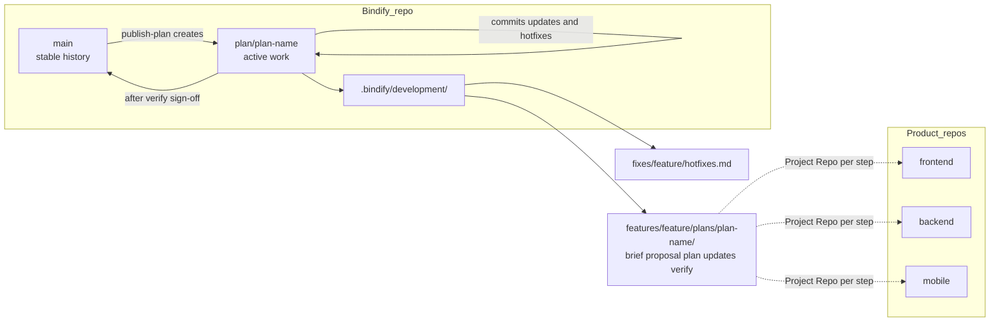
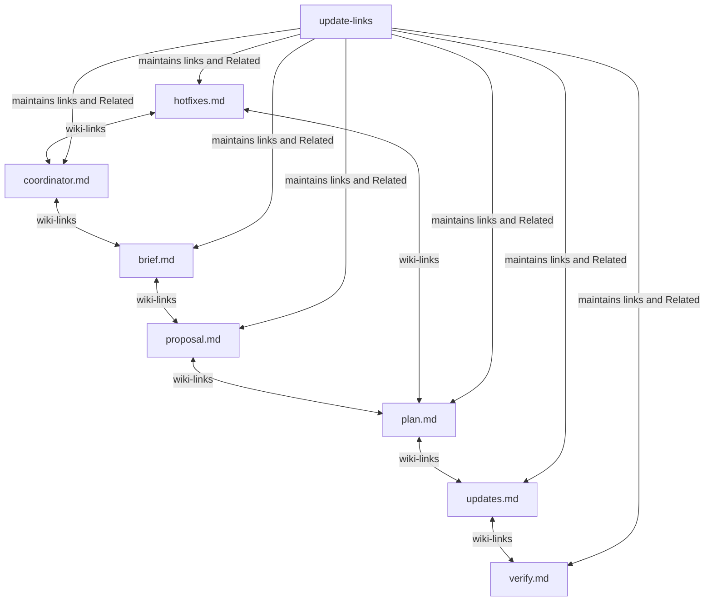
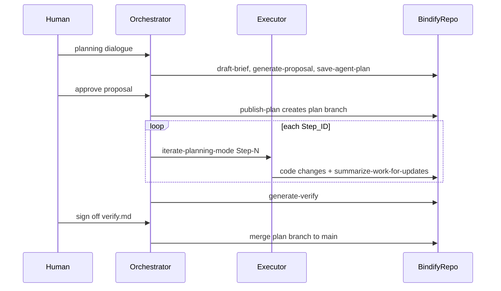

# Bindify Workflow — Visual Reference

Load this document when setting up a new product, publishing plan branches, or repairing markdown links. Do not load it on every command invocation — use `SKILL.md` for the command table and canonical pipeline diagram.

---

## Repo and branch model

Bindify tracking runs in one dedicated repository per product. Product code may span multiple repos (frontend, backend, mobile). Plan steps reference which repo they touch via a `Project Repo:` field in `plan.md`.



**Branch rules:**

- `main` — stable merged history only.
- `plan/<plan-name>` — created by `publish-plan` from an approved `plan.md`.
- Executor updates and hotfix logs commit to the active plan branch.
- Merge to `main` only after human sign-off on `verify.md`.

---

## Markdown link graph

Bindify markdown files form an Obsidian-compatible graph. Use inline `[[wiki-links]]` and a `## Related` section at the bottom of each file. Run `update-links` after any command that writes markdown.



---

## Orchestrator vs executor

The orchestrator (Claude Code, Cursor) drives planning and delegates step execution. Executors (pi instances) run one step per invocation against the shared workspace.

```
Claude Code (orchestrator)
  ├─ runs coordinate-updates → writes coordinator.md
  ├─ runs draft-brief + generate-proposal + save-agent-plan
  ├─ runs publish-plan → creates branch plan/<plan-name>
  ├─ spawns pi executor: pi -p "iterate-planning-mode Step-001"
  ├─ reads updates.md → decides next step
  └─ runs generate-verify when all steps done
```



**Executor contract:** read `STEP_ID` from `plan.md`, execute only that step's tasks, append to `updates.md`, exit. Never modify `plan.md` during apply.
